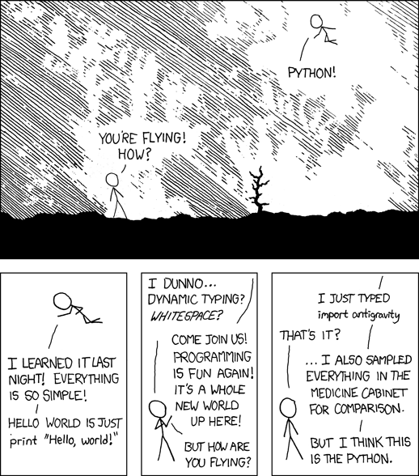

# Day_017_and_018

Day 17 and 18 of #100DaysofALXSE being an Easter holiday, I looked into python Easter eggs!


## Overview
Easter eggs are simply hidden features in a programming language. These functionalities are playful and undocumented and doesn't really serve any concrete purpose in software development. 

## History
The story of Warren Robinett's hidden message in the game "Adventure" for the Atari 2600 is believed to be the origin of Easter eggs in software development. Warren cleverly included a hidden functionality in the adventure game that when triggered would display "Created by Warren Robinett" on the gaming screen.
This was in response to lack of recognition and acknowledgement of developer efforts by the management. Infact the management at Atari tried so hard to hide developer's identities so that competitors would not hire them. Nobody at Atari was aware of this functionality until it was revealed by a 15-year old gamer who informed the company. The teenager detailed how to access the "secret room" and access the easter egg.
Ever since, developers have been including hidden secrets and surprises in their works. 

Five of the best Python Easter eggs include:

### The Zen of Python, by Tim Peters
Zen of python is a set of guiding principles for writing good python code. It actually encapsulates philosophy and design principles that govern development of python. 
To access this easter egg simply type `import this` in the python intepreter

Python 3.8.10 (default, Nov 22 2023, 10:22:35)
[GCC 9.4.0] on linux
Type "help", "copyright", "credits" or "license" for more information.
>>> import this
The Zen of Python, by Tim Peters

Beautiful is better than ugly.
Explicit is better than implicit.
Simple is better than complex.
Complex is better than complicated.
Flat is better than nested.
Sparse is better than dense.
Readability counts.
Special cases aren't special enough to break the rules.
Although practicality beats purity.
Errors should never pass silently.
Unless explicitly silenced.
In the face of ambiguity, refuse the temptation to guess.
There should be one-- and preferably only one --obvious way to do it.
Although that way may not be obvious at first unless you're Dutch.
Now is better than never.
Although never is often better than *right* now.
If the implementation is hard to explain, it's a bad idea.
If the implementation is easy to explain, it may be a good idea.
Namespaces are one honking great idea -- let's do more of those!

### The Python Comic
This Easter egg is a fun and clever way to showcase the spirit of Python and its community's sense of humor. This Easter egg is actually the "Python Logo". It is also a testament to the influence and popularity of both Python and xkcd within the programming community.

In the python intepreter, typing `import antigravity` will automatically open a web browser window/tab that takes you to a classic xkcd comic titled "Python." 
```py
Python 3.8.10 (default, Nov 22 2023, 10:22:35)
[GCC 9.4.0] on linux
Type "help", "copyright", "credits" or "license" for more information.
>>> import antigravity
```




### Hello world
A simple import of __hello__ prints out the very first famous line that beginers code

```py
Python 3.8.10 (default, Nov 22 2023, 10:22:35)
[GCC 9.4.0] on linux
Type "help", "copyright", "credits" or "license" for more information.
>>> import __hello__
Hello World!
>>> import __phello__
Hello world!
```


### Life's lesson
This is a simple trick of playing around with "this" module. It is about exploring the nature of love through boolean comparisons and in the end conveying a tongue-in-cheek sentiment about the complexities of love and life.

>>> import this
...
>>> love = this
>>> this is love
True
>>> love is True
False
>>> love is False
False
>>> love is not True or False
True
>>> love is not True or False; love is love  # FML
True

### The spideman's script

Filename:

    - spiderman.py
This script defines a function spiderman_easter_eggs with a list of Spider-Man-themed phrases. It randomly selects one phrase from the list and prints it. When you run the script, you'll get a different Spider-Man easter egg message each time.
