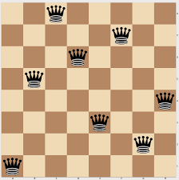

# Day_030

Day_030 of:
- #100daysofalxse Challenge
- #DoingHardThings
- #Dailygrowth

Today I handled a very famous interview exercise question.
The N-Queens puzzle

## The Puzzle
Given an N×N chessboard, the task is to place N queens on the board such that no two queens attack each other. Queens can attack each other if they share the same row, column, or diagonal. The objective is to find all possible configurations of queen placements on the board that satisfy these condition

The project requires an understanding of backtracking algorithms, which are a powerful technique for solving problems with a large search space. Backtracking involves systematically exploring all potential solutions to a problem and backtracking when a solution cannot be completed.

In the context of the N Queens problem, the backtracking algorithm works by placing queens on the board, one at a time, and checking if the current configuration is valid. If a queen can be placed without attacking any other queen, the algorithm proceeds to place the next queen. If no valid position is found for the current queen, the algorithm backtracks and tries a different position for the previous queen.

## Key concepts
- Backtracking Algorithms
- Recursion
- List Manipulation in Python
- Python Command Line Arguments

## Task
File:

- 0-nqueens.py
The N queens puzzle is the challenge of placing N non-attacking queens on an N×N chessboard. Write a program that solves the N queens problem.

Usage: nqueens N If the user called the program with the wrong number of arguments, print Usage: nqueens N, followed by a new line, and exit with the status 1

where N must be an integer greater or equal to 4 If N is not an integer, print N must be a number, followed by a new line, and exit with the status 1 If N is smaller than 4, print N must be at least 4, followed by a new line, and exit with the status 1

The program should print every possible solution to the problem One solution per line Format: see example You don’t have to print the solutions in a specific order You are only allowed to import the sys module