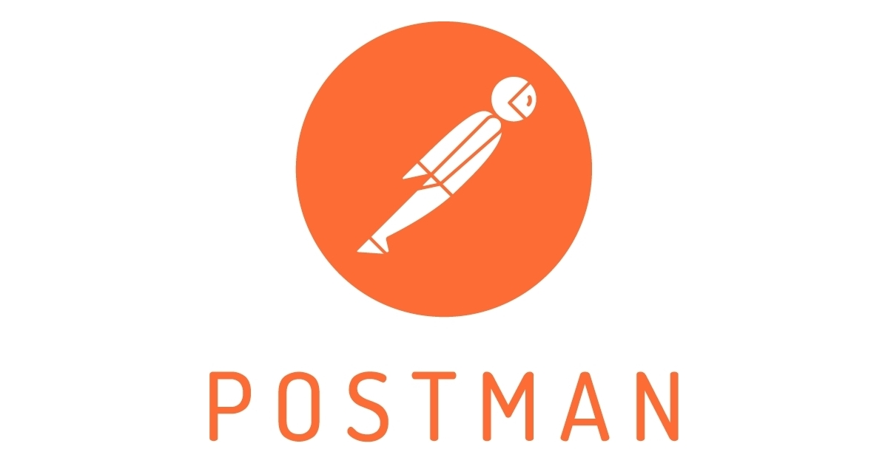

# Day_031

Day_019 of:
- #100daysofalxse 
- #DoingHardThings
- #Dailygrowth

Today I built on a concept that I already reviewed back on day_019.
I looked into the functionality of postman

## Overview
Postman is a powerful API (Application Programming Interface) development tool that simplifies the process of testing, documenting, and managing APIs. It offers a user-friendly interface for building, testing, and debugging APIs, making it an essential tool for developers, testers, and API consumers. 

I covered the following:
- Creating my own postman workspace and forking a coffee service project from where I will exercise on the APIs
- Manually testing the available API end points
- Using Postman variables to store secrets
